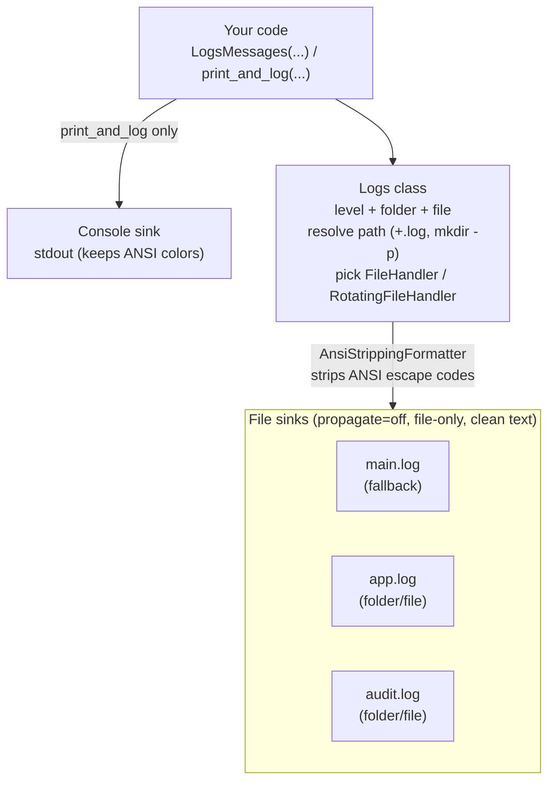

# Logger

> A stdlib-only leveled file logger with a friendly cockpit.

A small, reusable, standard-library-only logging helper. The `Logs` class wraps
Python's `logging` module to write DEBUG / INFO / WARNING / ERROR / CRITICAL
messages to log files — resolving relative or absolute paths, auto-appending
`.log`, and creating directories as needed. A polished CLI dashboard
(`dashboard.py`) drives every capability interactively or as a scripted demo.

All logging is file-only (`propagate` is disabled), so nothing reaches the
console except the explicit `print_and_log` helper.

## The idea

`Logs` is a thin, ergonomic layer over `logging` that removes the usual
boilerplate (handlers, formatters, path handling, fd cleanup). You point it at a
folder + file and a level, and it does the rest.



The file sinks use an `AnsiStrippingFormatter`, so colorized messages (common
when callers pass ANSI codes for the console) are recorded as clean,
grep-friendly text on disk while `print_and_log`'s console echo keeps its color.

Routing rules:
- `folder_name` + `file_name` given  → write to that specific file.
- an "engine" configured via `LogEngine(...)` → write to the engine's file.
- otherwise → fall back to the main logger (`main.log`).

## Features

- `Logs` class wrapping stdlib `logging` — no third-party runtime deps.
- Five levels: DEBUG, INFO, WARNING, ERROR, CRITICAL (via `LEVEL_MAP`).
- Automatic path resolution: relative paths resolve against the module dir; a
  `.log` extension is appended if missing; parent directories are created.
- A default "main" fallback logger plus per-call folder/file targeting.
- A named "engine" logger via `LogEngine`.
- ANSI-clean files: an `AnsiStrippingFormatter` removes color escape codes from
  file output, so log files stay readable while console echoes keep their color.
- Optional log rotation (`use_rotation=True`) via `RotatingFileHandler`.
- Clean lifecycle: `close()` and context-manager support that close file
  handlers to avoid descriptor leaks.
- An argparse CLI entry point in `Logger.py`, plus a branded `dashboard.py`
  cockpit (rich UI with a plain-ANSI fallback).

## Quickstart

```bash
pip install -r requirements.txt      # rich (optional UI) + pytest
python3 dashboard.py                  # interactive menu loop
python3 dashboard.py --demo           # scripted, non-interactive showcase
```

The dashboard is EOF/pipe-safe: `python3 dashboard.py < /dev/null` prints a
banner + status and exits promptly instead of blocking.

Representative `--demo` output (trimmed):

```
╭──────────────────────────────────────────────────────────────────╮
│  Logger  A stdlib-only leveled file logger with a friendly cockpit.│
╰──────────────────────────────────────────────────────────────────╯

╭───────────────────────── Demo wrote ─────────────────────────╮
│  File       Lines  Path                                      │
│  app.log        5  /tmp/logger_demo_xxxx/app.log             │
│  audit.log      2  /tmp/logger_demo_xxxx/audit.log           │
│  main.log       1  /tmp/logger_demo_xxxx/main.log            │
╰──────────────────────────────────────────────────────────────╯

╭──────────────── /tmp/logger_demo_xxxx/app.log ───────────────╮
│ 2026-07-05 21:00:43,929 - ..._app.log - DEBUG - sample ...   │
│ 2026-07-05 21:00:43,929 - ..._app.log - INFO - sample ...    │
│ 2026-07-05 21:00:43,929 - ..._app.log - WARNING - sample ... │
│ 2026-07-05 21:00:43,929 - ..._app.log - ERROR - sample ...   │
│ 2026-07-05 21:00:43,929 - ..._app.log - CRITICAL - sample ...│
╰──────────────────────────────────────────────────────────────╯

╭──────────────── /tmp/logger_demo_xxxx/main.log ──────────────╮
│ 2026-07-05 21:00:43,929 - MainLogger - WARNING - engine ...  │
╰──────────────────────────────────────────────────────────────╯

OK Demo complete: sample logs written across all levels.
```

The demo writes sample messages across every level to a couple of files in a
temp directory, prints the resulting file contents, cleans up, and exits 0.

## Usage

### Dashboard menu

`python3 dashboard.py` opens a menu:

1. **Compose a log message** — pick level / folder / file / message; writes via
   `Logs.LogsMessages` and previews the resulting file.
2. **Run the demo** — write all levels to sample files and print them.
3. **Tail / preview a log file** — list existing `.log` files and show the tail.
4. **Show where logs are written** — resolved paths for main / engine / direct
   targeting.

### Library API

```python
from Logger import Logs

with Logs() as log:
    # Fallback logger -> main.log
    log.LogsMessages("app started", message_type="info")

    # Named engine logger -> ExampleLogger/ExampleLogger.log
    log.LogEngine("ExampleLogger", "ExampleLogger")
    log.LogsMessages("engine message", message_type="debug")

    # Direct folder/file targeting -> CustomLogs/event.log
    log.print_and_log("direct message", message_type="warning",
                      folder_name="CustomLogs", file_name="event.log")

# Rotation
with Logs(use_rotation=True, max_bytes=1_000_000, backup_count=5) as log:
    log.LogsMessages("rotated log line")
```

Key methods:

- `Logs(default_log_level=logging.DEBUG, main_log_file="main.log", use_rotation=False, max_bytes=1048576, backup_count=3)`
- `resolve_log_path(path)` → absolute `.log` path (creates dirs).
- `construct_path(folder_name, file_name)` → absolute `.log` path (creates dirs).
- `log_to_file(message, TypeLog)` → write via the main fallback logger.
- `LogEngine(folder_name, log_name)` → configure the named engine logger.
- `LogsMessages(message, message_type="info", folder_name=None, file_name=None)`.
- `print_and_log(...)` → same as `LogsMessages` plus prints to stdout.
- `close()` / `__enter__` / `__exit__` → release file descriptors.

Unknown log levels degrade to `WARNING` and emit a warning about the typo.

### Logger.py CLI

```bash
python3 Logger.py --message "hello" --level INFO
python3 Logger.py -m "to a file" -l DEBUG --folder CustomLogs --file event.log --print
```

Options: `--message/-m` (required), `--level/-l`
(DEBUG|INFO|WARNING|ERROR|CRITICAL), `--folder/-d`, `--file/-f`, `--print`.
Running `python3 Logger.py` with no arguments runs a short built-in demo.

## Testing

```bash
python3 -m pytest -q
```

Currently **17 passing** (14 library tests + 3 dashboard tests covering
`--demo` exit 0, EOF/pipe safety, and `--help`).

## Project layout

```
Logger/
├── Logger.py           # Logs class + LEVEL_MAP + argparse CLI (main)
├── dashboard.py        # branded CLI cockpit (interactive + --demo)
├── test_logger.py      # library tests
├── test_dashboard.py   # dashboard subprocess tests
├── requirements.txt    # rich (optional) + pytest
├── pyproject.toml      # packaging + pytest config
├── docs/
│   └── screenshots/    # drop dashboard screenshots here
├── LICENSE             # MIT
└── README.md
```

Log directories (e.g. `main.log`, `CustomLogs/`, `ExampleLogger/`) are created
at runtime and are intentionally git-ignored — they are never committed.

<!-- Screenshot slot: add a dashboard capture and uncomment the line below.

-->


## Requirements / optional dependencies

- **Core library:** Python 3.9+ standard library only — no third-party deps.
- **Dashboard UI:** [`rich`](https://pypi.org/project/rich/) is optional. If it
  is importable the dashboard uses panels/tables/colored prompts; otherwise it
  falls back to clean plain-ANSI output.
- **Testing:** `pytest`.
